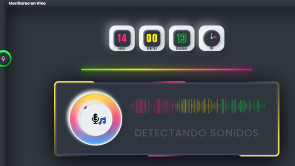
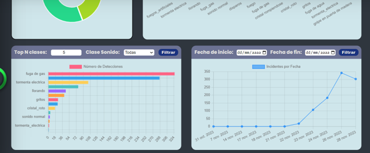

# Sistema de Detección de Sonidos Peligrosos en Tiempo Real

Aplicación de **Inteligencia Artificial** diseñada para detectar y clasificar sonidos en tiempo real en entornos domésticos. Utilizando técnicas de procesamiento de señales de audio y aprendizaje automático con **HTS-Audio-Transformer**, la aplicación identifica patrones asociados con sonidos seguros y peligrosos, proporcionando alertas inmediatas en caso de detectar situaciones potencialmente riesgosas.

## ¿Qué resuelve?

* Detecta sonidos de emergencia (robos, fugas de gas, accidentes eléctricos) en tiempo real.
* Emite alertas inmediatas para reducir tiempos de respuesta ante situaciones de riesgo.
* Alternativa asequible frente a sistemas de seguridad tradicionales.

## ¿Qué puede hacer el sistema?

| Funcionalidad | Descripción |
| --- | --- |
| **Captura de Audio en Tiempo Real** | Adquisición de datos de audio desde micrófonos y dispositivos de captura. |
| **Preprocesamiento de Audio** | Filtrado de ruido, normalización y segmentación del audio capturado. |
| **Detección Inteligente** | Análisis del audio mediante HTS-Audio-Transformer para clasificar sonidos seguros y peligrosos. |
| **Sistema de Alertas** | Notificaciones inmediatas en la interfaz de usuario cuando se detecta un peligro. |
| **Dashboard de Monitoreo** | Interfaz gráfica para visualizar alertas y acceder a estadísticas en tiempo real. |
| **Estadísticas y Reportes** | Filtrado de sonidos reportados por tipo y fecha. |

## Capturas de Pantalla

**Buscando sonidos peligrosos en tiempo real**



**Sonido peligroso detectado (Fuga de gas)**


**Estadísticas de sonidos reportados**



## Tecnologías

* **Backend:** Python (Flask)
* **Frontend:** HTML, CSS, JavaScript
* **Modelo de IA:** HTS-Audio-Transformer (HT-SAT)
* **Procesamiento de Audio:** Librosa, NumPy
* **Deep Learning:** PyTorch

## Instalación y Ejecución

1. Clonar el repositorio e instalar dependencias:

```bash
pip install -r requirements.txt
```

2. Ejecutar la aplicación web:

```bash
python app.py
```

3. Para predicción en tiempo real:

```bash
python predict_real_time.py
```

## Requisitos

* Python 3.8+
* PyTorch
* Flask
* Librosa
* NumPy

## Estructura del Proyecto

```
├── app.py                      # Aplicación web principal (Flask)
├── predict_real_time.py        # Predicción de sonidos en tiempo real
├── models.py                   # Definición de modelos
├── sed_model.py                # Modelo de detección de eventos sonoros
├── utils.py                    # Funciones auxiliares
├── esc_config.py               # Configuración del modelo
├── data_generator.py           # Generador de datos para entrenamiento
├── model/
│   ├── htsat.py                # Implementación HT-SAT
│   └── layers.py               # Capas del modelo
├── scrips_preprocesamiento/    # Scripts de preprocesamiento de audio
│   ├── aumentar_dataset.ipynb
│   ├── converter_m4a_a_wav.ipynb
│   ├── convertir_16bits.ipynb
│   └── ...
├── static/
│   ├── css/                    # Estilos
│   ├── js/                     # Scripts frontend
│   └── img/                    # Imágenes
├── templates/
│   └── Frontend/               # Vistas HTML
│       ├── index.html
│       ├── dasbord.html
│       ├── monitoreo_tiempo_real.html
│       └── estadisticas.html
└── docs/
    └── imgs/                   # Imágenes de documentación
```

## Metodología

### Adquisición de Datos
Recolección en tiempo real de datos de audio provenientes de micrófonos instalados en el domicilio.

### Preprocesamiento
Eliminación de ruido, normalización del volumen y segmentación en intervalos manejables.

### Entrenamiento
Uso de algoritmos de aprendizaje profundo con HTS-Audio-Transformer (HT-SAT) para entrenar el modelo de clasificación.

### Validación
Validación exhaustiva utilizando un conjunto de datos de prueba independiente con ajustes para mejorar la precisión.

## Notas

Proyecto académico desarrollado para la materia de **Inteligencia Artificial** de la carrera de Ingeniería de Sistemas - Universidad San Francisco Xavier de Chuquisaca.

**Autor:** Rodrigo Rosario Cruz